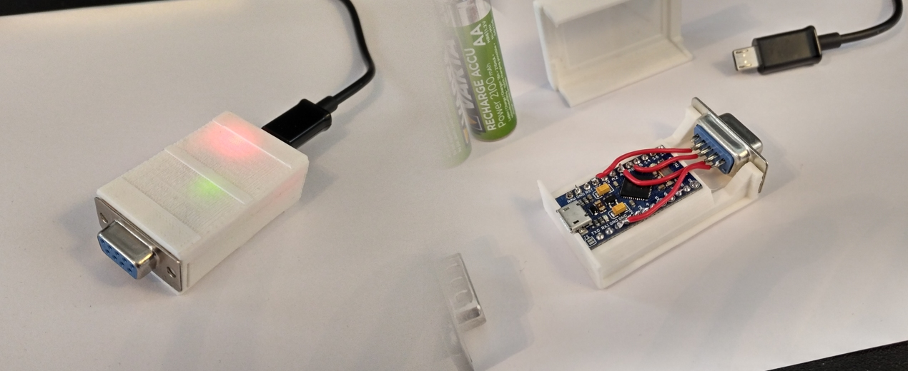
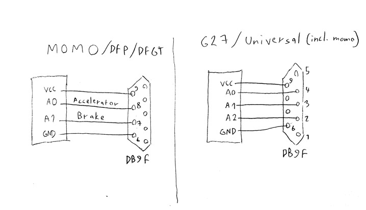

# Logitech Pedals To Usb

Complete hardware project for using the Logitech pedals as an independent usb device

## Usage
  Connect the pedals to the device and plug it to usb. During startup keep the pedals first at rest and then press them down to change modes. The initialization phase ends after 5 seconds by default.
  
  Modes:
  - Combined accelerator & brake reporting, keep the pedals at rest for the whole phase.
  - Separate axis reporting, keep one of the pedals pressed
  - Digital reporting only, keep both of the pedals pressed

## Requirements
  - Logitech racing wheel (Tested with Momo Racing Wheel, most likely works with other Logitech pedals as well)
  - Arduino with ATmega32u4 (Leonardo, Pro micro etc.)
  - [Arduino Joystick Library](https://github.com/MHeironimus/ArduinoJoystickLibrary)

## Case
  The case is designed for Pro Micro and is toleranced for snap fit. The STL file contains the toleranced model, while the STEP file contains the model with exact dimensions.

## Wiring

  Connect DB9 pin 9 to VCC and pin 6 to GND. For MOMO/DFP/DFGT pots are wired as pairs to 2&7 and 3&8. For G27 only pins 2, 3 and 4 are used for pots.
  
  If you plan to use this for only MOMO, solder pins 7 and 8 to analog inputs for simpler wiring. If you plan to use this with G27 or want a more universal adapter, solder pins 2, 3 and 4 to analog inputs.

  Modify the configuration macros at project file to enable clutch and if axes are mapped wrong.

## Instructions
  1. Clone repo
  2. Install [Arduino Joystick Library](https://github.com/MHeironimus/ArduinoJoystickLibrary)
  3. Modify the configuration macros in LogitechPedalsToUsb.ino to
      - Rearrange input pins
      - Invert axes
      - Enable clutch 
      - Change initialization phase duration
  4. Compile LogitechPedalsToUsb.ino and upload
  5. 3d-print the case and solder the circuit
  6. Glue DB9 socket to outer wall
  7. Snap the case shut
  8. Enjoy